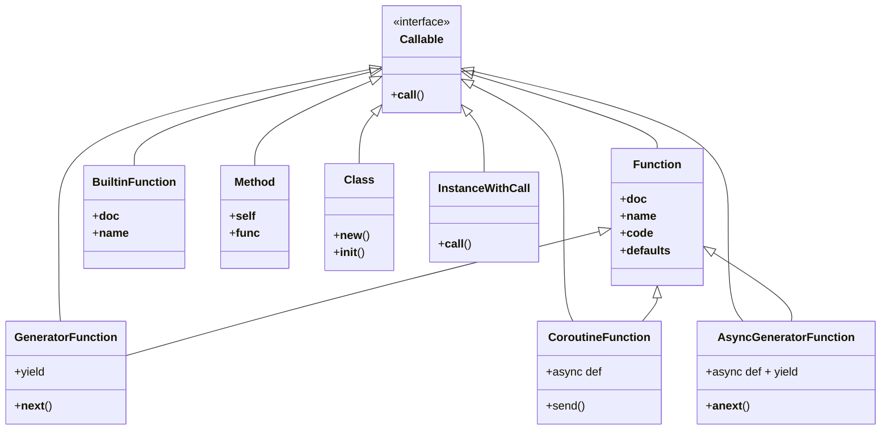

# Структура презентации

## Глава 7: Функции как полноправные объекты

1. **Слайд 1: Эпиграф. Функции как полноправные объекты** — цитата Гвидо ван Россума и определение полноправных объектов.

2. **Слайд 2: Что значит «функция — полноправный объект»** — четыре свойства полноправных объектов, пример с функцией factorial.

3. **Слайд 3: Атрибуты функций и интроспекция** — атрибут `__doc__`, команда `help()`, примеры использования.

4. **Слайд 4: Присваивание и передача функций** — демонстрация присваивания функции переменной и передачи в качестве аргумента (map).

5. **Слайд 5: Функции высшего порядка** — определение, примеры: `sorted`, `map`, `filter`, `reduce`.

6. **Слайд 6: Современные альтернативы map, filter, reduce** — сравнение с генераторными и списковыми включениями, роль `sum`.

7. **Слайд 7: Анонимные функции (lambda)** — синтаксис, ограничения, рецепт рефакторинга Лундха.

8. **Слайд 8: Девять видов вызываемых объектов** — полный список вызываемых типов в Python, функция `callable()`.

9. **Слайд 9: Пользовательские вызываемые типы** — реализация метода `__call__`, пример класса BingoCage.

10. **Слайд 10: Гибкая система параметров** — позиционные, именованные, `*args`, `**kwargs`, пример функции tag.

11. **Слайд 11: Чисто именованные и чисто позиционные параметры** — синтаксис `*` и `/`, примеры из PEP 3102 и PEP 570.

12. **Слайд 12: Модуль operator** — функции `mul`, `itemgetter`, `attrgetter`, `methodcaller`, примеры использования.

13. **Слайд 13: functools.partial — фиксация аргументов** — создание новых вызываемых объектов с предопределенными аргументами.

14. **Слайд 14: Диаграмма. Иерархия вызываемых объектов** — UML-диаграмма девяти вызываемых типов Python.

15. **Слайд 15: Диаграмма. Механизм передачи аргументов** — схема обработки позиционных и именованных аргументов.

16. **Слайд 16: Резюме и ключевые выводы** — основные идеи главы: полноправность, функции высшего порядка, гибкость параметров.


### **Слайд 1: Эпиграф. Функции как полноправные объекты**

**Эпиграф:**
> Я никогда не считал, что на Python оказали заметное влияние функциональные языки, что бы кто об этом ни говорил или ни думал. Я был значительно лучше знаком с императивными языками типа C и Algol 68 и, хотя сделал функции полноправными объектами, никогда не рассматривал Python как язык функционального программирования.
>
> *— Гвидо ван Россум, пожизненный великодушный диктатор Python*

**Определение полноправного объекта:**
- Может быть создан во время выполнения
- Может быть присвоен переменной или полю структуры данных
- Может быть передан функции в качестве аргумента
- Может быть возвращен функцией в качестве результата

**Заметки:**
Этот слайд открывает главу, посвящённую функциям как полноправным объектам. Эпиграф выбран неслучайно: Гвидо ван Россум подчёркивает, что, несмотря на наличие функциональных черт, Python остаётся императивным языком по своей сути. Полноправность функций — это техническая возможность, а не идеологический выбор в пользу функционального программирования. Четыре перечисленных свойства делают функции равноправными с числами, строками и словарями. Понимание этих свойств открывает двери к более гибкому и выразительному коду. В этой главе мы увидим, как эти возможности применяются на практике, включая функции высшего порядка, декораторы и гибкую работу с аргументами.

---

### **Слайд 2: Что значит «функция — полноправный объект»**

**Пример: функция factorial**
```python
>>> def factorial(n):
...     """Возвращает n!"""
...     return 1 if n < 2 else n * factorial(n - 1)
...
>>> factorial(42)
1405006117752879898543142606244511569936384000000000
```

**Демонстрация свойств:**
- Создана во время выполнения (в сеансе оболочки)
- Имеет атрибуты: `factorial.__doc__` возвращает `'returns n!'`
- Является экземпляром класса `function`
```python
>>> type(factorial)
<class 'function'>
```

**Заметки:**
На этом слайде мы наглядно демонстрируем, что функция в Python — это такой же объект, как и любое другое значение. Она создаётся динамически, имеет собственные атрибуты (например, `__doc__` для хранения строки документации) и принадлежит к определённому типу `function`. В отличие от статически компилируемых языков, где функции существуют только на уровне исходного кода, в Python функция является полноценным объектом времени выполнения. Это позволяет не только вызывать её, но и анализировать её структуру, модифицировать и передавать. Наличие атрибута `__doc__` особенно важно, поскольку он используется системой помощи (`help()`) для генерации справочной информации.

---

### **Слайд 3: Атрибуты функций и интроспекция**

**Атрибут `__doc__` и справка:**
```python
>>> factorial.__doc__
'returns n!'
>>> help(factorial)   # выводит подробную справку
```

**Рис. 7.1. Справка по функции factorial. Текст берётся из атрибута `__doc__` объекта-функции**

*[Описание рисунка: скриншот интерактивной справки, показывающий сигнатуру функции и строку документации]*

**Другие атрибуты функции:**
- `__name__` — имя функции
- `__defaults__` — значения по умолчанию позиционных параметров
- `__kwdefaults__` — значения по умолчанию именованных параметров
- `__code__` — скомпилированный байт-код

**Заметки:**
Объекты-функции в Python содержат богатую метаинформацию, доступную через встроенные атрибуты. Атрибут `__doc__` — это не просто комментарий, а документированная часть интерфейса, которая извлекается инструментами автоматической генерации документации и системой помощи. На рисунке 7.1 показано, как команда `help()` форматирует эту информацию для пользователя. Помимо `__doc__`, существует множество других атрибутов, позволяющих проводить глубокую интроспекцию: можно узнать имя функции, значения аргументов по умолчанию и даже получить доступ к байт-коду. Эта метаинформация широко используется фреймворками для реализации таких возможностей, как автоматическая валидация параметров, логирование и создание прокси-объектов. Интроспекция функций — важная часть метапрограммирования в Python.

---

### **Слайд 4: Присваивание и передача функций**

**Присваивание функции переменной:**
```python
>>> fact = factorial
>>> fact
<function factorial at 0x...>
>>> fact(5)
120
```

**Передача функции в качестве аргумента:**
```python
>>> map(factorial, range(11))
<map object at 0x...>
>>> list(map(factorial, range(11)))
[1, 1, 2, 6, 24, 120, 720, 5040, 40320, 362880, 3628800]
```

**Ключевые моменты:**
- Функция может иметь несколько имён (factorial и fact ссылаются на один объект)
- Функция может быть передана другой функции (как `factorial` в `map`)
- `map` возвращает итератор, который лениво вычисляет результаты

**Заметки:**
На этом слайде мы переходим от теории к практике, показывая, как полноправность функций проявляется в реальном коде. Присваивание функции переменной — простейший пример: теперь у объекта-функции есть два имени, но сам объект остаётся единственным. Гораздо важнее возможность передавать функцию как аргумент. Функция `map` — классический пример функции высшего порядка: она принимает другую функцию и применяет её к каждому элементу итерируемого объекта. Обратите внимание, что `map` в Python 3 возвращает не список, а итератор (объект `map`), что соответствует принципу ленивых вычислений. Преобразование в список с помощью `list()` заставляет итератор вычислить все значения. Эта возможность передачи функций открывает путь к декларативному стилю программирования, где мы описываем *что* сделать, а не *как*.

---

### **Слайд 5: Функции высшего порядка**

**Определение:**
Функция высшего порядка — это функция, которая:
- принимает другую функцию в качестве аргумента, или
- возвращает функцию в качестве результата

**Примеры в Python:**
- `sorted(iterable, key=func)` — сортировка с пользовательским ключом
- `map(func, iterable)` — применение функции к каждому элементу
- `filter(func, iterable)` — отбор элементов по условию
- `reduce(func, iterable)` — свёртка последовательности

**Пример сортировки по длине строки:**
```python
>>> fruits = ['strawberry', 'fig', 'apple', 'cherry', 'raspberry', 'banana']
>>> sorted(fruits, key=len)
['fig', 'apple', 'cherry', 'banana', 'raspberry', 'strawberry']
```

**Пример сортировки по обратному порядку букв:**
```python
>>> sorted(fruits, key=lambda word: word[::-1])
['banana', 'apple', 'fig', 'raspberry', 'strawberry', 'cherry']
```

**Заметки:**
Функции высшего порядка — краеугольный камень функционального программирования, но они широко применяются и в императивных языках. В Python самый частый пример — параметр `key` в `sorted`, `min` и `max`. Передавая функцию в качестве ключа, мы полностью контролируем логику сравнения, не меняя при этом основного алгоритма. Это пример стратегии «открытость для расширения, закрытость для изменения». Функции `map`, `filter` и `reduce` исторически были основными инструментами функциональной обработки данных. На этом слайде показано, как с помощью `sorted` и лямбда-функции можно сортировать строки не в алфавитном порядке, а по любому заданному правилу — например, по обратной строке, что группирует слова, оканчивающиеся одинаково. Гибкость, достигаемая за счёт передачи функций, значительно сокращает количество шаблонного кода.

---

### **Слайд 6: Современные альтернативы map, filter, reduce**

**Сравнение map и списковых включений:**
```python
>>> list(map(factorial, range(6)))
[1, 1, 2, 6, 24, 120]

>>> [factorial(n) for n in range(6)]
[1, 1, 2, 6, 24, 120]
```

**Сравнение map + filter с включением:**
```python
>>> list(map(factorial, filter(lambda n: n % 2, range(6))))
[1, 6, 120]

>>> [factorial(n) for n in range(6) if n % 2]
[1, 6, 120]
```

**Функция sum как замена reduce:**
```python
>>> from functools import reduce
>>> from operator import add
>>> reduce(add, range(100))
4950

>>> sum(range(100))
4950
```

**Встроенные редуцирующие функции:**
- `all(iterable)` — True, если все элементы истинны
- `any(iterable)` — True, если хотя бы один элемент истинен

**Заметки:**
С появлением списковых включений и генераторных выражений необходимость в `map` и `filter` значительно снизилась. Как видно из примеров, включения не только короче, но и читаются естественнее, особенно когда требуется одновременно преобразование и фильтрация. Лямбда-выражение в комбинации `map+filter` становится избыточным. Функция `reduce`, некогда встроенная, теперь вынесена в модуль `functools`, а для большинства практических задач суммирования используется встроенная `sum`, которая работает быстрее и понятнее. Кроме `sum`, в Python есть и другие редуцирующие функции: `all` и `any`, которые также сводят последовательность к одному значению, но уже булеву. Важно отметить, что переход от `map/filter/reduce` к включениям и специализированным функциям не означает отказ от функционального стиля, а скорее его адаптацию к идиоматическому Python, где читаемость кода стоит на первом месте.

---

### **Слайд 7: Анонимные функции (lambda)**

**Синтаксис:**
```python
lambda arguments: expression
```

**Ограничения:**
- Тело может быть только выражением, не может содержать операторов (`while`, `try`, `=`)
- Назначение — создание небольших одноразовых функций

**Пример: сортировка с lambda:**
```python
>>> fruits = ['strawberry', 'fig', 'apple', 'cherry', 'raspberry', 'banana']
>>> sorted(fruits, key=lambda word: word[::-1])
['banana', 'apple', 'fig', 'raspberry', 'strawberry', 'cherry']
```

**Рецепт рефакторинга лямбда-выражений (Фредрик Лундх):**
1. Напишите комментарий, объясняющий, что делает lambda
2. Придумайте имя, отражающее суть комментария
3. Преобразуйте lambda в `def` с этим именем
4. Удалите комментарий

**Заметки:**
Лямбда-функции — это удобный, но ограниченный инструмент. Их главное предназначение — создание функций «на лету» в местах, где полное определение через `def` было бы избыточным. Однако синтаксические ограничения Python делают лямбда-выражения непригодными для сложной логики: внутри lambda нельзя использовать присваивания, циклы, обработку исключений. Если лямбда становится слишком сложной для понимания, это верный признак того, что её следует заменить обычной функцией. Рецепт Фредрика Лундха предлагает простой путь рефакторинга: сначала осмыслить назначение кода, дать ему имя, а затем реализовать через `def`. Такой подход улучшает читаемость, упрощает отладку (в трассировке стека будет имя функции, а не `<lambda>`) и делает код более поддерживаемым. В отличие от JavaScript или других языков, где лямбда-функции используются повсеместно, в Python они остаются скорее вспомогательным, чем основным средством.

---

### **Слайд 8: Девять видов вызываемых объектов**

**Вызываемые объекты (поддерживают оператор `()`):**

| № | Тип | Пример |
|---|------|--------|
| 1 | Пользовательские функции | `def f(): ...` или `lambda: ...` |
| 2 | Встроенные функции | `len`, `print`, `open` |
| 3 | Встроенные методы | `dict.get`, `list.append` |
| 4 | Методы | функции, определённые в теле класса |
| 5 | Классы | `str(42)`, `MyClass()` |
| 6 | Экземпляры классов (с `__call__`) | экземпляры, реализующие `__call__` |
| 7 | Генераторные функции | содержат `yield` в теле |
| 8 | Платформенные сопрограммы | `async def` без `yield` (Python 3.5+) |
| 9 | Асинхронные генераторы | `async def` с `yield` (Python 3.6+) |

**Проверка на вызываемость:**
```python
>>> callable(abs)
True
>>> callable(str)
True
>>> callable('Ni!')
False
```

**Заметки:**
В Python оператор вызова `()` может применяться к гораздо более широкому кругу объектов, чем просто функции, определённые через `def`. В документации Python перечислено девять категорий вызываемых объектов. Пользовательские и встроенные функции — самые очевидные. Классы при вызове создают новый экземпляр, проходя через методы `__new__` и `__init__`. Экземпляры классов становятся вызываемыми, если в классе определён метод `__call__` — это мощный инструмент для создания объектов, ведущих себя как функции, но сохраняющих состояние. Генераторные функции возвращают итераторы и помечаются наличием `yield`. С появлением асинхронного программирования в Python 3.5 и 3.6 добавились сопрограммы и асинхронные генераторы, которые также являются вызываемыми, но возвращают специальные объекты для работы с asyncio. Функция `callable()` — самый безопасный способ проверить, можно ли вызвать объект, поскольку она корректно обрабатывает все эти случаи.

---

### **Слайд 9: Пользовательские вызываемые типы**

**Реализация `__call__`:**
```python
import random

class BingoCage:
    def __init__(self, items):
        self._items = list(items)
        random.shuffle(self._items)

    def pick(self):
        try:
            return self._items.pop()
        except IndexError:
            raise LookupError('pick from empty BingoCage')

    def __call__(self):
        return self.pick()
```

**Использование:**
```python
>>> bingo = BingoCage(range(3))
>>> bingo.pick()
1
>>> bingo()          # вызов экземпляра как функции
0
>>> callable(bingo)
True
```

**Заметки:**
Метод `__call__` позволяет любому экземпляру класса стать вызываемым объектом. В примере с BingoCage мы создаём класс, который хранит внутреннее состояние (перемешанный список элементов) и предоставляет как обычный метод `pick()`, так и возможность прямого вызова экземпляра. Это удобно, когда объект по своей сути представляет собой функцию с памятью: каждый вызов изменяет внутреннее состояние. Такой подход часто используется в декораторах, где требуется сохранять данные между вызовами (например, кэш результатов), а также в любых сценариях, где нужен объект, сочетающий поведение функции с богатыми возможностями класса. В отличие от простой функции, экземпляр с `__call__` может иметь множество методов, атрибутов и сложную логику инициализации. Это пример того, как полноправность функций и объектно-ориентированное программирование пересекаются в Python.

---

### **Слайд 10: Гибкая система параметров**

**Пример функции tag (генерация HTML):**
```python
def tag(name, *content, class_=None, **attrs):
    """Сгенерировать один или несколько HTML-тегов"""
    if class_ is not None:
        attrs['class'] = class_
    attr_pairs = (f' {attr}="{value}"' for attr, value in sorted(attrs.items()))
    attr_str = ''.join(attr_pairs)
    if content:
        elements = (f'<{name}{attr_str}>{c}</{name}>' for c in content)
        return '\n'.join(elements)
    else:
        return f'<{name}{attr_str} />'
```

**Различные способы вызова:**
```python
>>> tag('br')
'<br />'

>>> tag('p', 'hello')
'<p>hello</p>'

>>> tag('p', 'hello', id=33)
'<p id="33">hello</p>'

>>> tag('p', 'hello', 'world', class_='sidebar')
'<p class="sidebar">hello</p>\n<p class="sidebar">world</p>'

>>> my_tag = {'name': 'img', 'src': 'sunset.jpg', 'class': 'framed'}
>>> tag(**my_tag)
''
```

**Заметки:**
Функция `tag` демонстрирует всю мощь системы параметров Python. Позиционный параметр `name` обязателен. Конструкция `*content` собирает все дополнительные позиционные аргументы в кортеж. Параметр `class_` — чисто именованный (передаётся только по имени), что позволяет обойти конфликт с зарезервированным словом `class`. Конструкция `**attrs` собирает все именованные аргументы, не указанные явно, в словарь. При вызове функции можно комбинировать позиционные и именованные аргументы в любом порядке, использовать распаковку последовательностей (`*`) и словарей (`**`). В примере с `**my_tag` словарь превращается в отдельные именованные аргументы, которые затем обрабатываются параметрами функции. Такая гибкость позволяет создавать API, которые легко использовать в самых разных сценариях, от простых до сложных, без перегрузки функций или множества версий.

---

### **Слайд 11: Чисто именованные и чисто позиционные параметры**

**Чисто именованные параметры (Keyword-Only):**
- Указываются после `*` в сигнатуре функции
- Не могут быть переданы позиционно, только по имени

```python
>>> def f(a, *, b):
...     return a, b
...
>>> f(1, b=2)
(1, 2)
>>> f(1, 2)        # ошибка!
TypeError: f() takes 1 positional argument but 2 were given
```

**Чисто позиционные параметры (Positional-Only) — Python 3.8+:**
- Указываются до `/` в сигнатуре функции
- Не могут быть переданы по имени

```python
>>> def divmod(a, b, /):
...     return (a // b, a % b)
...
>>> divmod(10, 4)
(2, 2)
>>> divmod(a=10, b=4)   # ошибка!
TypeError: divmod() takes no keyword arguments
```

**Комбинирование:**
```python
def tag(name, /, *content, class_=None, **attrs):
    # name — чисто позиционный
    # content — позиционные, собираются в кортеж
    # class_ — чисто именованный
    # attrs — собирает остальные именованные
```

**Заметки:**
Python предлагает два специальных маркера в сигнатурах функций: `*` и `/`. Звёздочка `*` отделяет чисто именованные параметры — они могут быть переданы только по имени, что повышает читаемость вызовов и позволяет избежать путаницы при большом количестве параметров. Слэш `/` (добавлен в Python 3.8) определяет чисто позиционные параметры, которые нельзя передать по имени. Такая возможность долгое время существовала для встроенных функций (например, `divmod`), и теперь доступна для пользовательских функций. Чисто позиционные параметры полезны, когда имя параметра не имеет значения для внешнего API или может конфликтовать с зарезервированными словами. Комбинируя оба маркера, можно создавать точные и выразительные сигнатуры, которые диктуют, как именно должна вызываться функция, улучшая читаемость кода и предотвращая ошибки.

---

### **Слайд 12: Модуль operator**

**Основные функции:**
- `add`, `sub`, `mul`, `truediv` — арифметические операции
- `itemgetter`, `attrgetter`, `methodcaller` — создание функций для доступа

**Пример: factorial с operator.mul:**
```python
>>> from functools import reduce
>>> from operator import mul
>>> def factorial(n):
...     return reduce(mul, range(1, n + 1))
...
>>> factorial(5)
120
```

**Пример itemgetter:**
```python
>>> from operator import itemgetter
>>> metro_data = [('Tokyo', 'JP', 36.933), ('Delhi NCR', 'IN', 21.935)]
>>> sorted(metro_data, key=itemgetter(1))
[('Delhi NCR', 'IN', 21.935), ('Tokyo', 'JP', 36.933)]
```

**Пример attrgetter:**
```python
>>> from operator import attrgetter
>>> from collections import namedtuple
>>> Latlon = namedtuple('Latlon', 'lat lon')
>>> city = ('Tokyo', 'JP', Latlon(35.689722, 139.691667))
>>> get_lat = attrgetter('coord.lat')
```

**Пример methodcaller:**
```python
>>> from operator import methodcaller
>>> s = 'The time has come'
>>> hyphenate = methodcaller('replace', ' ', '-')
>>> hyphenate(s)
'The-time-has-come'
```

**Заметки:**
Модуль operator предоставляет функциональные эквиваленты встроенных операторов Python. Вместо написания тривиальных лямбда-функций, таких как `lambda a, b: a * b`, можно использовать готовую функцию `mul`, что делает код лаконичнее и читаемее. Особую ценность представляют функции-конструкторы: `itemgetter` создаёт функцию, которая извлекает элемент по индексу (или ключу) из последовательности или отображения; `attrgetter` извлекает атрибуты объекта, поддерживая доступ к вложенным атрибутам через точки; `methodcaller` создаёт функцию, вызывающую метод с заданными аргументами. Эти инструменты идеально подходят для использования в качестве аргументов `key` в `sorted`, `min`, `max`, а также в `map` и `filter`. Они реализованы на C, поэтому работают быстрее эквивалентных решений на чистом Python. Использование operator — это пример идиоматического Python, где функциональные возможности сочетаются с производительностью и читаемостью.

---

### **Слайд 13: functools.partial — фиксация аргументов**

**Назначение:**
- Создаёт новый вызываемый объект, фиксируя часть аргументов исходной функции

**Пример с mul:**
```python
>>> from operator import mul
>>> from functools import partial
>>> triple = partial(mul, 3)    # фиксируем первый аргумент = 3
>>> triple(7)
21
>>> list(map(triple, range(1, 10)))
[3, 6, 9, 12, 15, 18, 21, 24, 27]
```

**Пример с unicode.normalize:**
```python
>>> import functools
>>> nfc = functools.partial(unicodedata.normalize, 'NFC')
>>> s1 = 'café'
>>> s2 = 'café\u0301'
>>> nfc(s1) == nfc(s2)
True
```

**Пример с функцией tag:**
```python
>>> from tagger import tag
>>> picture = partial(tag, 'img', class_='pic-frame')
>>> picture(src='wumpus.jpeg')
''
```

**Атрибуты объекта partial:**
- `func` — исходная функция
- `args` — кортеж зафиксированных позиционных аргументов
- `keywords` — словарь зафиксированных именованных аргументов

**Заметки:**
`functools.partial` — мощный инструмент для адаптации функций к существующим API. Он позволяет создать новую функцию с меньшим числом параметров, «заморозив» часть аргументов. В примере с `triple` мы фиксируем первый аргумент `mul` как 3, получая функцию одного аргумента, которую можно использовать с `map`. В примере с нормализацией Unicode мы создаём специализированную функцию `nfc`, избавляясь от необходимости каждый раз указывать `'NFC'`. Это особенно полезно, когда требуется передать функцию обратного вызова (callback) с определённой сигнатурой. Объект `partial` хранит исходную функцию и зафиксированные аргументы в открытых атрибутах, что позволяет при необходимости получить доступ к ним. `partial` не копирует исходную функцию, а создаёт обёртку, поэтому накладные расходы минимальны. Это пример того, как Python поддерживает функциональное программирование без ущерба для прагматичности.

---

### **Слайд 14: Диаграмма. Иерархия вызываемых объектов**



**Заметки:**
На диаграмме представлена иерархия девяти вызываемых типов Python, объединённых возможностью применять оператор `()`. В основе лежит абстрактное понятие вызываемого объекта. Пользовательские функции (созданные через `def` или `lambda`) и встроенные функции (написанные на C) — наиболее простые представители. Методы — это функции, привязанные к объектам, они хранят ссылку на экземпляр (`__self__`). Классы при вызове создают экземпляры через механизм `__new__` и `__init__`. Экземпляры с методом `__call__` становятся вызываемыми, что позволяет создавать объекты, ведущие себя как функции с состоянием. Генераторные функции отличаются наличием `yield` и возвращают итераторы. С появлением асинхронного программирования добавились сопрограммы (`async def` без `yield`) и асинхронные генераторы (`async def` с `yield`), которые работают в контексте событийных циклов. Все эти типы корректно распознаются функцией `callable()`. Понимание иерархии вызываемых объектов важно для написания гибкого кода, работающего с самыми разными видами вызываемых сущностей.

---

### **Слайд 15: Диаграмма. Механизм передачи аргументов**

```mermaid
flowchart TD
    A[Вызов функции<br/>func(a, b, c, d)] --> B{Разбор аргументов}
    
    B --> C[Позиционные аргументы<br/>до * или /]
    B --> D[Именованные аргументы<br/>после *]
    B --> E[Распаковка *iterable]
    B --> F[Распаковка **mapping]
    
    C --> G[Связывание с позиционными<br/>параметрами]
    D --> H[Связывание с чисто<br/>именованными параметрами]
    E --> I[Элементы iterable<br/>как позиционные]
    F --> J[Пары key-value<br/>как именованные]
    
    G --> K{Остались<br/>аргументы?}
    H --> K
    I --> K
    J --> K
    
    K -->|Да| L{Есть *args?}
    K -->|Нет| M{Есть **kwargs?}
    
    L -->|Да| N[Собрать в *args]
    L -->|Нет| O[Ошибка: лишние<br/>аргументы]
    
    M -->|Да| P[Собрать в **kwargs]
    M -->|Нет| Q[Вызов функции]
    
    N --> Q
    P --> Q
    O --> R[TypeError]
```

**Заметки:**
Диаграмма иллюстрирует, как Python обрабатывает аргументы при вызове функции. Процесс начинается с разбора переданных аргументов, которые могут быть позиционными, именованными, распакованными из последовательности (`*iterable`) или из отображения (`**mapping`). Python сначала связывает позиционные аргументы с соответствующими параметрами, затем — именованные. Чисто позиционные параметры (до `/`) не могут быть связаны по имени, а чисто именованные (после `*`) — по позиции. Если после связывания остаются лишние позиционные аргументы, они собираются в параметр `*args` (если он объявлен), иначе возникает ошибка `TypeError`. Аналогично, лишние именованные аргументы собираются в `**kwargs`. Этот механизм обеспечивает невероятную гибкость: одна и та же функция может вызываться десятками различных способов. Понимание порядка обработки аргументов критически важно при создании функций с вариативными сигнатурами, особенно при разработке декораторов и функций высшего порядка, где аргументы часто передаются дальше.

---

### **Слайд 16: Резюме и ключевые выводы**

**Основные идеи главы:**

1. **Функции — полноправные объекты**
   - Могут создаваться, присваиваться, передаваться и возвращаться
   - Имеют атрибуты (`__doc__`, `__name__`, `__code__` и др.)

2. **Функции высшего порядка широко используются**
   - `sorted`, `min`, `max` с параметром `key`
   - `map`, `filter` (но включения часто удобнее)
   - `functools.reduce` (для специальных случаев)

3. **Гибкая система параметров**
   - Позиционные, именованные, `*args`, `**kwargs`
   - Чисто именованные (после `*`) и чисто позиционные (до `/`)

4. **Девять видов вызываемых объектов**
   - От простых функций до асинхронных генераторов
   - `callable()` для проверки

5. **Инструменты функционального программирования**
   - `operator` — функции для операторов, `itemgetter`, `attrgetter`
   - `functools.partial` — фиксация аргументов

**Важно помнить:**
- Python не является функциональным языком, но заимствует полезные идеи
- Читаемость кода важнее краткости
- Лямбда-функции хороши для простых случаев, сложные лучше оформлять через `def`

**Заметки:**
Эта глава показала, что функции в Python — это не просто конструкции для группировки кода, а полноценные объекты со своим местом в системе типов языка. Полноправность функций открывает возможности для функционального стиля программирования: функции высшего порядка, лямбда-выражения, модули `operator` и `functools`. Однако, как подчёркивал Гвидо ван Россум, Python не стремится быть функциональным языком — он заимствует только те идеи, которые улучшают читаемость и практичность кода. Гибкая система параметров позволяет создавать API любой сложности, сохраняя ясность вызовов. Девять видов вызываемых объектов демонстрируют богатство языка, где не только функции, но и классы, экземпляры с `__call__`, генераторы и сопрограммы могут вызываться единообразно. Главный вывод: понимание функций как объектов — это ключ к написанию гибкого, переиспользуемого и элегантного кода, будь то декораторы, обратные вызовы или создание предметно-ориентированных языков (DSL) внутри Python.

---

### **Слайд 18: Дополнительная литература**

**Официальная документация Python:**
- [Модель данных Python — иерархия стандартных типов](https://docs.python.org/3/reference/datamodel.html#the-standard-type-hierarchy) — описание всех девяти вызываемых типов
- [PEP 3102 — Keyword-Only Arguments](https://peps.python.org/pep-3102/) — история и обоснование чисто именованных параметров
- [PEP 570 — Positional-Only Parameters](https://peps.python.org/pep-0570/) — спецификация чисто позиционных параметров (Python 3.8)
- [Python Functional Programming HOWTO](https://docs.python.org/3/howto/functional.html) — руководство по функциональному программированию от A. M. Kuchling

**Книги:**
- David Beazley, Brian K. Jones. *Python Cookbook*, 3rd Edition. O'Reilly. — Глава 7 дополняет материал этой и девятой глав
- Alex Martelli, Anna Ravenscroft, Steve Holden. *Python in a Nutshell*, 3rd Edition. O'Reilly. — подробное объяснение `functools.partial`

**Статьи и блоги:**
- Guido van Rossum. [Origins of Python's Functional Features](http://python-history.blogspot.com/2009/04/origins-of-pythons-functional-features.html) — история появления `map`, `filter`, `lambda` в Python
- Guido van Rossum. [Tail Recursion Elimination](http://neopythonic.blogspot.com/2009/04/tail-recursion-elimination.html) — причины отсутствия оптимизации хвостовой рекурсии

**Презентации:**
- Luciano Ramalho. *Beyond Paradigms* — слайды (Speaker Deck) и видео (YouTube) о том, почему классификация языков по парадигмам устарела

**Дополнительный материал на сайте fluentpython.com:**
- [Introspection of Function Parameters](https://www.fluentpython.com/extra/function-introspection/) — расширенный материал об интроспекции параметров функций

**Заметки:**
Раздел дополнительной литературы структурирован по категориям, чтобы облегчить навигацию. Официальная документация Python — первичный источник для глубокого понимания модели данных и спецификаций PEP. Книги David Beazley и Alex Martelli являются классическими справочниками, которые подробно раскрывают практические аспекты использования функций высшего порядка, `operator` и `functools`. Статьи Гвидо ван Россума в блоге дают уникальное историческое и техническое обоснование решений, принятых в языке, включая причины, по которым Python не стал функциональным языком. Презентация «Beyond Paradigms» предлагает альтернативный взгляд на классификацию языков программирования, что перекликается с заключительным разделом главы «Поговорим». Материал на сайте fluentpython.com дополняет главу техническими деталями об интроспекции функций, которые были вынесены из печатного издания для сохранения фокуса на ключевых концепциях.
